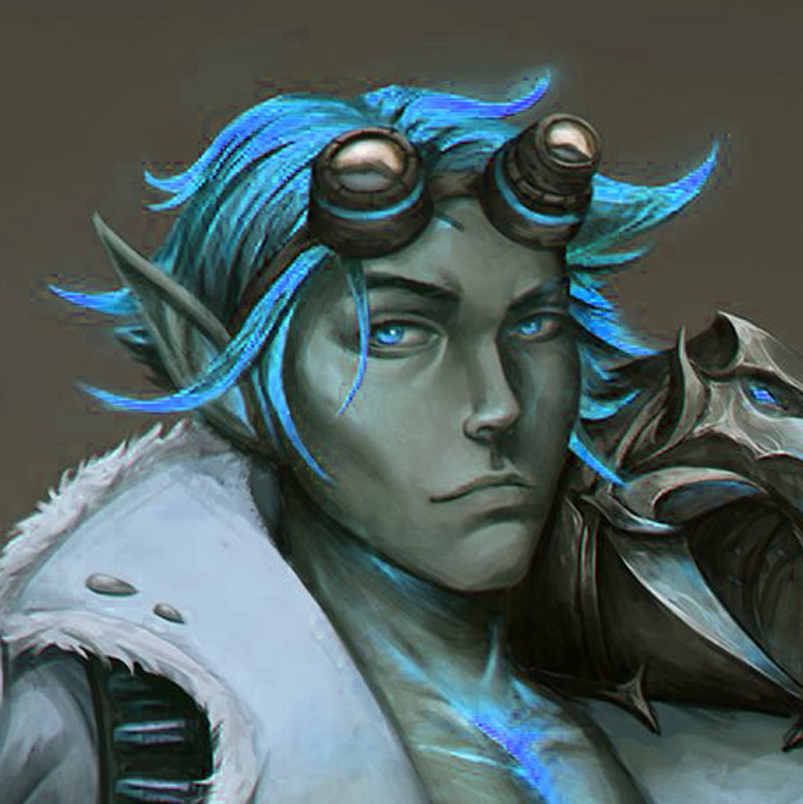
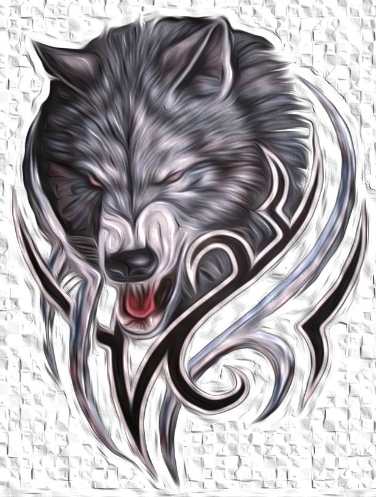
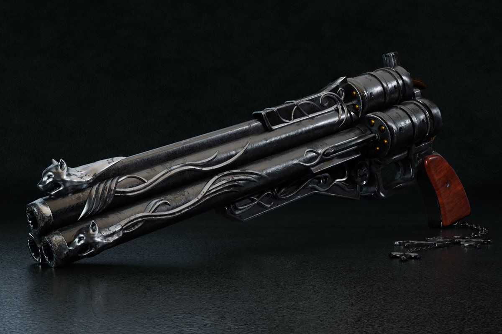
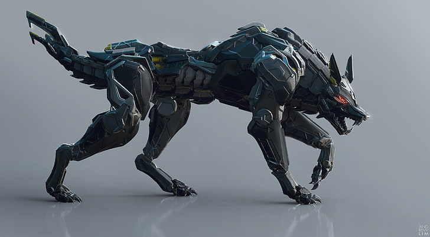

# Physical Description

On a day-to-day basis, Valkiiren wears a large leather trench coat with a large emblem on the back centre, usually covered by a backpack and a shield. This emblem is his mentor’s family crest (The Warwicks).
Under his trench coat, on his left is a leather holster, with a midnight black revolver being held within’ it. Unlike most revolvers, this one seems to have a triple barrel, and for the magically inclined, enchanted.

        

# Family Crest

On a day-to-day basis, Valkiiren wears a large leather trench coat with a large emblem on the back centre, usually covered by a backpack and a shield. This emblem is his mentor’s family crest (The Warwicks).
Under his trench coat, on his left is a leather holster, with a midnight black revolver being held within’ it. Unlike most revolvers, this one seems to have a triple barrel, and for the magically inclined, enchanted.

              

# Valkiiren's Weapon

This gun was passed on to Valkiiren from his Mentor, it’s a weapon which has been in the Warwick family for generations. 

    

# Mechanical Beast

Through months of Tinkering with various types of magic and metals, identifying their strengths, weaknesses, opportunities for improvement, Valkiiren has created something unique. Valkiiren has discovered, by imbuing metals with a finely tuned magic similar to the type used to create his Homunculus servant, he create a more powerful beast.

        