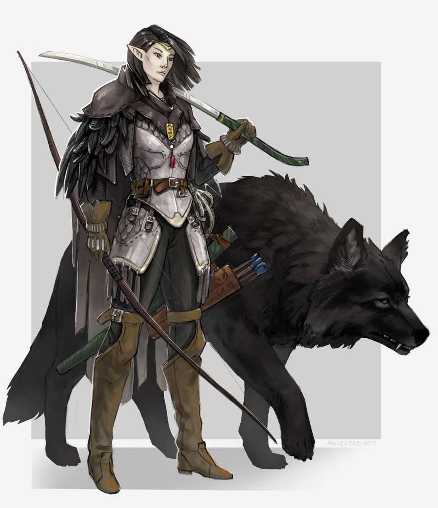
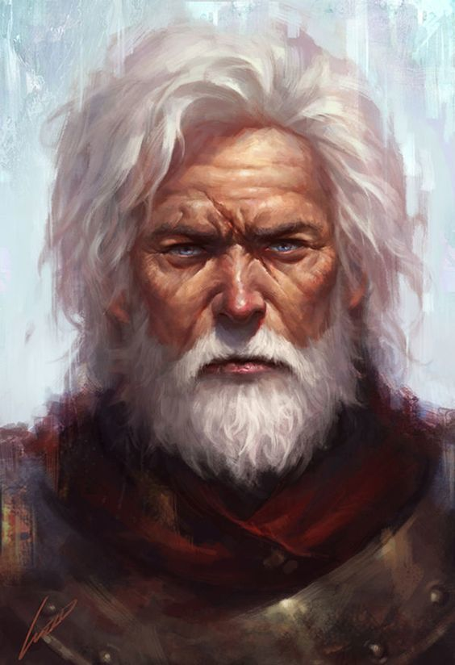

# The Warwick Clan 

The Warwick clan originates deep within' the forests of the Imperium. The clan was of a moderate size and comprised of Wolf Breeders, Tamers, blacksmiths (Rider / Wolf Amour & Weapons) and of course, Riders.  

The Clan used to serve the empire by supplying highly trained Riders to the battlefield. However over the Centuries more and more of the clan instead choose to stay back and protect various towns which are vulnerable to attack. 

Every rider is trained in the arts of hunting, combat, and stealth, making it nearly impossible to find them if they don't want to be found. Which also makes it very dangerous to go looking for them.

As of today, most of the clan is split up all across the Imperium, usually sticking to their roots by living in a forest. There's no way to tell how many are still out there, only another Rider can track them and they're far n' few between. Warwicks are usually neutral good, tending to only show themselves if a situation would lead to many deaths.   

   

# Clan's Crest

This crest is bestowed upon all the Wolf Riders. It represents the completion of their training, being released into the true world. Most Riders believe that the spirits of past riders watch over them, and protect them, while they wear the crest. This belief creates powerful warriors, whether it's true or not, it allows them to trust in the spirits for, and fight all out. 

              

# Lucian Warwick (Valkiiren's Mentor)

Lucian Warwick, is a Rider from the Warwick clan. Up untill he was 19, he lived peacefully deep in the forest, as a Rider in training. Every day he'd wake up and train with his mentor, learning the ways of tracking, hunting and killing. Upon graduation he was free to do whatever he wanted. (TBC, Joins war, barely gets out, his Mentor sacrifices himself)

    

## 
[Return to Index](./README.md)
